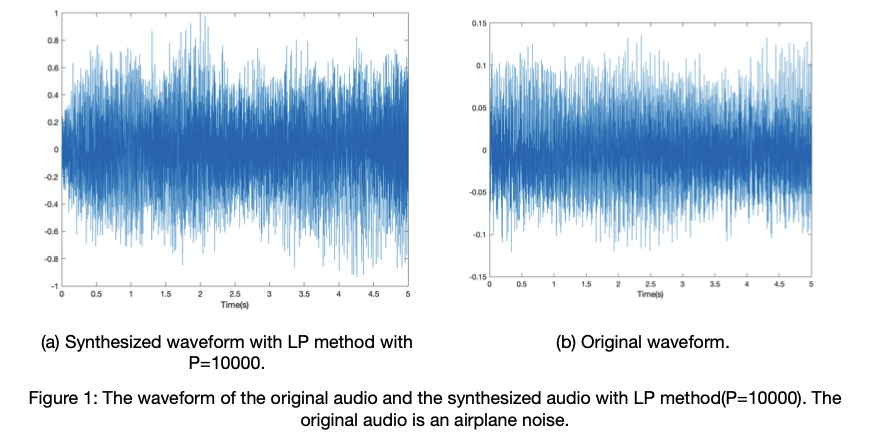
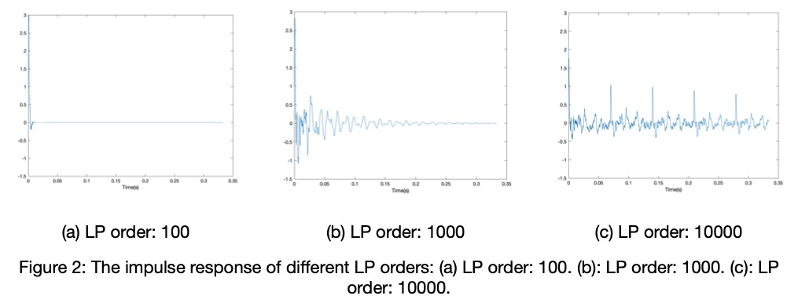
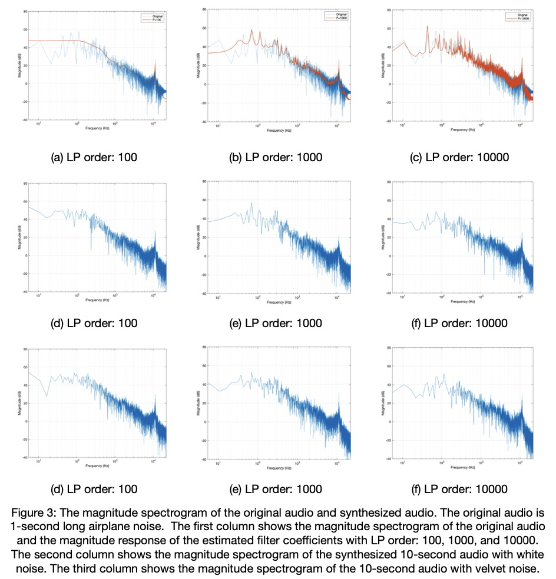
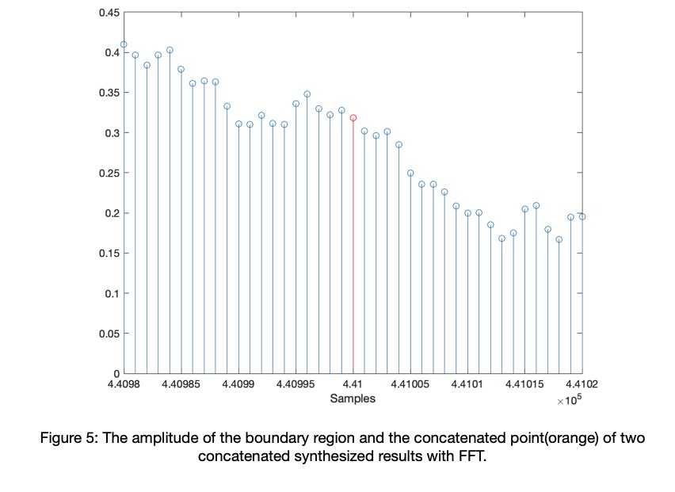

# Creating-Endless-Sound
This repository implements [Creating Endless Sound](http://research.spa.aalto.fi/publications/papers/dafx18-endless/), and it is the final project for MUMT 501 Digital Audio Signal Processing. 

## Objective
Use a short audio segment to synthesize a long audio samples, which can be used to generate background ambience in movie or game.

## Usage
**Python**
The `Lpc.py` only implements the LPC method with white noise.

Required packages: 
* `librosa`
* `scipy.io`
* `scipy.signal`
* `numpy`

`python3 Lpc.py --in_path <input audio path : str> --order <lpc order : int> --sec <The length (s) of the output file : float>`

**Matlab**
The `main.m` contains 2 methods:
1. LPC method with both white noise and velvet noise.
2. `FFT` and `iFFT`.

## Background
The goal of creating endless sounds use a small amount of data to synthesis sounds with a longer duration, and the synthesized sound needs to be similar but not identical to the reference sound. The method can benefit the need for endless sound samples in movies and games, and also as background noise when conducting a listening test.

Looping a short sample may be a solution to generate the endless sound, but it requires manual labor to crop the looping section and decide the cross-fade section between successive sessions. Besides, the quality of the looped audio depends on the short samples. Looped audio may seem repetitive if there are audible events in the short sample, and clicks may appear near the boundary between successive sessions.

[1] proposed 3 methods to solve create endless sounds: synthesis with higher-order linear prediction (LP) method, real-time synthesis with velvet noise, and synthesis with inverse fast Fourier transform.

## Synthesis with LP method
The higher-order LP method is a parametric modeling technique, and it models the spectrogram as an autoregressive process. In this method, short samples are used as input audio, and a higher-order LP method is used to estimate linear prediction coefficients to model the frequency characteristics of the short samples. The endless sound can be synthesized by filtering an arbitrary long white noise with an all-pole IIR filter with its feedback coefficients set to the estimated linear prediction coefficients.

`Figure 1` shows the waveform of the original samples and the synthesized result with LP order equals `10000`. The short sample to estimate LP coefficients is 1-second long audio cropped from the original sample. The white noise randomly excites the filter resonance in time, and as we can observe from `figure 1`, results in the amplitude fluctuation in the synthesized audio. `Figure 2` shows the impulse response of LP orders set to `100` and `10000`. We can observe that the impulse response gets longer as the order grows.

Figure 3 shows the magnitude spectrogram of the input audio, which is a 1-second long airplane noise, the magnitude spectrogram of 10-second long synthesized output, and the magnitude response of LP filters with different orders. We can observe that low-order coefficients model the overall structure of the magnitude spectrogram but fails to model the details, such as peaks in the low-frequency part. As the order increases, details are modeled more accurately, and the magnitude spectrogram of the 10-second synthesized audio is more close to the original 1-second audio.

## Real-time Real-time Synthesis with Velvet Noise
To reduce the computation cost, the white noise can be replaced by velvet noise. Velvet noise is a pseudo-random sequence consists of 3 values only: `-1.0`, `0.0`, and `1.0`. More than 90% of the samples are set to `0.0`, while the remaining samples are either `-1.0` or `0.`0. Velvet noise is used for artificial reverberation and decorrelating audio signals. Because more than 90% of samples are set to `0.0`, the computation time can be significantly reduced. `Figure 3` shows the synthesized result using velvet noise. The results are similar to the results from white noise.

## Synthesis with Fast Fourier transform (FFT) and Inverse Fast Fourier transform (IFFT)
The last method utilizes Fast Fourier transform, as the time-domain convolution of two signals is equivalent to the frequency-domain multiplication. The frequency-domain representations of the short signal `s` and the white noise `w` are `S = R_s e^{jθ_s}` and `W = R_w e^{jθ_w} `, and the multiplication of their frequency representations is `SW = R_s R_w e^{j(θ_s + θ_w)}`. Considering that the magnitude spectrogram of white noise is flat and the phase spectrogram is randomized between `−π` and `+π` , the multiplication can be simplified as `SW = R_s e^{jθ_r}` , where `θr = [0,r,0,r̂]` with `r` being a sequence of random phases between `−π` and `+π` and `r̂` is `r` in reversed order.

In implementation, the input short signal is zero-padded to the same length as the output signal. Its magnitude spectrogram `R_s` is calculated, and its phase is replaced with `θ_r`. Finally, the inverse Fourier transform is conducted to get the synthesized long audio. `Figure 4` shows the magnitude spectrogram of the 6-second synthesized result, and the result is close to those of the magnitude spectrogram from LP filters in `figure 3`. With the use of circular convolution, synthesized audio can be concatenated to each other to get longer audio without introducing continuity between the boundary. The amplitude of the boundary region and the concatenate point of two concatenated synthesized audios are shown in `figure 5`.

## Reference
[1] V. Välimäki, J. Rämö, and F. Esqueda, “Creating endless sounds,” in Proc. 21st Int. Conf. Digital Audio Effects (DAFx-18), Aveiro, Portugal, 2018, pp. 32–39.

